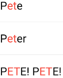
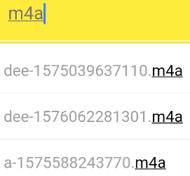

# substring_highlight

Highlight Flutter text at the character-level.

Designed for case-insensitive search-term highlighting, a single search term sub-string is highlighted (perhaps multiple times) within a longer string.

Inspired by the existing Flutter package "highlight_text" which supports word matches ('Peter''), but substring_highlight has more granular character-by-character matches (e.g., 't' in 'Peter').

Limitations:
1. Highlighted text is not clickable
2. Needs a flag to promote granularity to word-level instead of character-level.
3. Doesn't solve perplexing world problems

The substrings being searched for highlighting _don't_ have to match at the *beginning* of the longer strings (can be anywhere inside).

Even space characters will match, but not be highlighted, obviously.

Ancestor MUST have textDirection set (required by internal RichText widget), either through MaterialApp widget or explicitly wrapped by a Directionality widget:
```
Directionality(
    child: SubstringHighlight(text: 'Peter', term: 't'),
    textDirection: TextDirection.ltr)
```


# Pull Requests
Pull requests are welcome!


# Examples
## Default Styling Example
### Code:
As an example, the following code snippet uses this package to highlight matching characters in each search result:  
```
import 'package:substring_highlight/substring_highlight.dart';

...

  @override
  Widget build(BuildContext context) (
    return Container(
      padding: const EdgeInsets.all(12),
      child: SubstringHighlight(
        text: dropDownItem,     // search result string from database or something
        term: searchTerm,       // user typed "et"
      ),
    );
  )
```
### Output:



## Customized Styling Example
### Code:
This example adds 'textStyle' and 'textStyleHighlight' to change the colors of the text:  
```
import 'package:substring_highlight/substring_highlight.dart';

...

  @override
  Widget build(BuildContext context) (
    return Container(
      padding: const EdgeInsets.all(12),
      child: SubstringHighlight(
        text: dropDownItem,                         // each string needing highlighting
        term: searchTerm,                           // user typed "m4a"        
        textStyle: TextStyle(                       // non-highlight style                       
          color: Colors.grey,
        ),
        textStyleHighlight: TextStyle(              // highlight style
          color: Colors.black,
          decoration: TextDecoration.underline,
        ),        
      ),
    );
  )
```
### Output:
